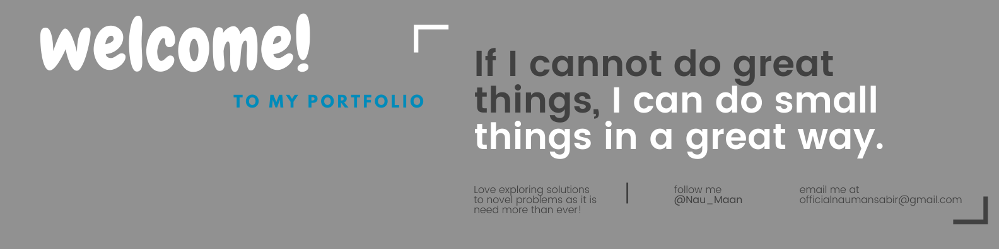

## Nauman Sabir -  Machine Learning Engineer | Python

Welcome to my GitHub profile! I'm Nauman Sabir, a Computer Scientist with a passion for problem-solving and a strong interest in Machine Learning. I have a clear, logical mind and a practical approach to tackling challenges. My goal is to see projects through to completion while applying my expertise in building and deploying ML models.

🌍 Location:Pakistan
📞 Contact: +92 303 7743354
📧 Email: officialnaumansabir@gmail.com
💼 LinkedIn: [naumansabir](https://www.linkedin.com/in/naumansabir)

## Experience

**Sr. Python Developer** at Exponento, Lahore Pakistan  
Mar 2023 - May 2023 (3 mos)

- Developed an innovative machine learning API that utilizes OpenAI's Whisper technology for transcribing videos.
- Utilized the power of ChatGPT3.5 Turbo to generate key takeaways and translations from the transcribed videos.
- Utilized AWS EC2 to host the app and ensure the scalability and reliability of the platform.
- Ensured fast and accurate generation of key takeaways and translations by utilizing parallelism to process multiple video files simultaneously.

**Software Engineer** at WeCrunch, Lahore Pakistan  
Oct 2019 - Mar 2023 (3 yrs 5 mos)

- Developed a Django app on Azure for P&G, used by 500+ employees in 19 countries for financial tracking, predictions, and insights.
- Implemented Natural Language Generation (NLG) for P&G's Monthly Sales Data, automating their reporting process and saving an estimated 20 hours per month.
- Created forecasting models for time-series sales data, resulting in targeted promotions, increased revenue, and improved sales strategies for P&G.
- Built a Microsoft PowerApps-based Customer's Financial Claims system for P&G, increasing processing speed by 5x and efficiency by 90%.
- Developed various data strategies, including predictive and prescriptive analysis.
- Implemented multiple power automation solutions to streamline internal processes for P&G.

## Projects

**Facial-based Attendance & Emotion Recognition System** - Final Year Project

- A machine learning-based system for managing attendance and extracting emotions to improve the learning curves of students.
- Technologies used: Python, Keras, OpenCV, CNN, Numpy, Flask, SQLAlchemy.

**Intelligent English Tutor** - Semester Project

- An Android app that addresses the difficulties faced by new learners of the English language. It utilizes IBM Watson to create personal English assistants.
- Technologies used: Android, IBM Watson.

**Urdu Guru** - Client Project (USA)

- An Android app designed to help English speakers learn the Urdu language.
- Technologies used: Android, Google Sheets, Adobe Illustrator.

## Education

**Bachelor of Science in Computer Science**  
Government College University Faisalabad, Pakistan  
2015 - 2019
- Grade: 3.75/4.0
- CSI-301 Programming Fundamentals
- CSI-302 Object Oriented Programming
- CSI-401 Data Structure and Algorithms
- CSI-406 Design & Analysis of Algorithms
- CSI-408 Numerical Computing
- CSI-508 Artificial Intelligence
- CSI-512 Computer Networks
- CSI-616 Fundamental of Data Mining

## Skills

- Programming Languages: Python, Dart, Java, C++
- Machine Learning Frameworks: Keras, Tensorflow, PyTorch
- AI Models: OpenAI Whisper, ChatGPT3
- Libraries & Tools: Pyannote, FFmpeg, Pandas, Numpy, OpenCV
- Web Development: Django, Flask, FastAPI, HTML5, CSS3, Bootstrap
- Mobile Development: Flutter, Android
- Other: Linux Terminal, Debugging, Troubleshooting

## Personal Skills

- Good communication skills
- Remarkable leadership skills
- Problem-solving skills
- Excellent conceptual skills
- Excellent self-learning skills
- Impressive analytical skills

## Certificates

- Neural Networks and Convolutional Neural Networks Essential Training by LinkedIn Learning (03/2019)
- Artificial Intelligence Foundations: Machine Learning (03/2022)
- Deep Learning: Face Recognition by LinkedIn Learning (04/2019)
- Deep Learning: Image Recognition by LinkedIn Learning (03/2022)
- Building Deep Learning Applications with Keras 2.0 by LinkedIn Learning (04/2019)
- Ethical Hacking: Overview by LinkedIn Learning (03/2019)
- Logic and Computational Thinking by Microsoft (10/2018)

